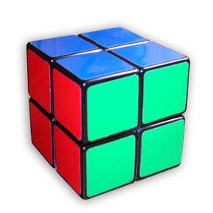

#二阶魔方“上帝之数“的验证

##上帝之数
上帝之数是指，还原任意状态的魔方所需的最小步数。

三阶魔方有43,252,003,274,489,856,000（约合4.3×10的19次方）种不同的可能组合状态，但它都能在20步之内还原，于是三阶魔方的上帝之数就是20。

二阶魔方的上帝之数为11。

##这段代码如何工作的？
这段代码可以推算出，由二阶魔方还原好了的状态出发，经过11步可以得到3,674,160种不同的状态，而二阶魔方正是有(5040*2187)/3=3674160种状态，这样就验证了二阶魔方的上帝之数是11。

